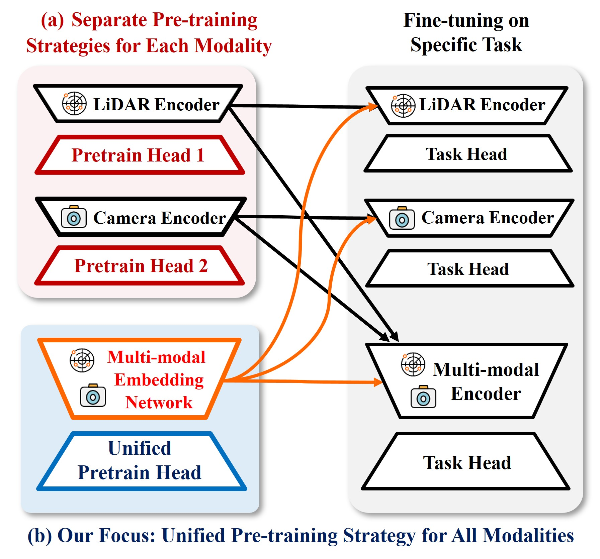

<h1>Towards Unified Pre-training Framework for 3D&BEV Perception</h1>
<h3>[Official] NS-MAE: A Simple Yet Unified Self-supervised Pre-training</h3>
 <h3>Strategy for LiDAR-Camera 3D Perception</h3>

 
  

## Abstract
This work proposes a **unified self-supervised pre-training framework for transferable multi-modal perception representation learning** via masked multi-modal reconstruction in Neural Radiance Field (NeRF), namely **NeRF-Supervised Masked AutoEncoder (NS-MAE)**. Leveraging NeRF's inherent coupling of appearance and geometry, the model learns to reconstruct missing or corrupted data across multiple modalities. Specifically, embeddings are extracted from corrupted LiDAR point clouds and images, conditioned on view directions and locations. Then, these embeddings are rendered into multi-modal feature maps from two crucial viewpoints for 3D driving perception: perspective and bird's-eye views. The original uncorrupted data serve as reconstruction targets for self-supervised learning.

## Main Transfer Results

Baseline: Multi-modal/Fusion-based `BEVFusion`

> Notice: Due to the limitation of computation resources, **CBGS/Database-sampler data-augmentation is not used** during pre-training.

### 3D Object Detection (on nuScenes validation)

|        Model         | Modality | ImageSize | LidarSweep  | mAP  | NDS  | Checkpoint  |
| :------------------: | :------: |:---------:| :---------: | :--: | :--: | :---------: |
| BEVFusion            |   C+L    | 128 × 352 |      1      | 50.5 | 53.3 |    /        |
| +NS-MAE              |   C+L    | 128 × 352 |      1      | **51.5** | **54.7** |   /          |
| BEVFusion            |   C+L    | 256 × 704 |      9      | 60.8 | 64.1 |    [Link](https://drive.google.com/file/d/1J3jNqKzW080uPu2QW_MZxUMckAuOmL3Q/view?usp=sharing)         |
| +NS-MAE              |   C+L    | 256 × 704 |      9      | **63.0** | **65.5** |   [Link](https://drive.google.com/file/d/1DMeqyjvQRpPuxcjr2ByO-VgnJ-DmLvr0/view?usp=sharing)          |

### BEV Map Segmentation (on nuScenes validation)

|        Model         | Modality | ImageSize | LidarSweep  | mIoU | Checkpoint  | 
| :------------------: | :------: |:---------:| :---------: | :--: | :---------: |
| BEVFusion            |    C+L   | 256 × 704 |      9      | 42.9 |   [Link](https://drive.google.com/file/d/1uPz6XdR9SiFkusFICbnxwHfClnjZAQ4_/view?usp=sharing)          |
| +NS-MAE              |    C+L   | 256 × 704 |      9      | **46.6** |    [Link](https://drive.google.com/file/d/1bfOu9CbneKlG9nIXlOpcRa21biuDYmUo/view?usp=sharing)         |
| BEVFusion            |     C    | 256 × 704 |      /      | 40.1 |   [Link](https://drive.google.com/file/d/10jCVf4WtkaSjFxwfeoEhqTMuZApJUeSR/view?usp=sharing)          |
| +NS-MAE              |     C    | 256 × 704 |      /      | **44.3** |     [Link](https://drive.google.com/file/d/1hhzbcIoadkSqVDW8eUR-G1YZjmX-ljio/view?usp=sharing)        |

## Label-efficient Transfer Results

### 3D Object Detection (on nuScenes validation)

| Method | Modality | ImageSize |LidarSweep  | Metric | 1%          |   5% |10% | 100% |
|:-----------------------:|:-----------------------:|:----------------------------------:|:----------------------------------:|:-----------------------:|:----------------------------------:|:----------------------------------:|:----------------------------------:|:----------------------------------:|
| BEVFusion             |    C+L   | 256 × 704 |      9      | mAP                   | 26.2                  | 46.1                             | 54.2                    | 60.8                   |
| +NS-MAE               |    C+L   | 256 × 704 |      9      |    mAP                      | **30.2**   | **47.6**                  | **55.9**                   | **63.0**                    |
| BEVFusion             |    C+L   | 256 × 704 |      9      | NDS     | 44.2                  | 55.4                             | 60.3                    | 64.1                   |
| +NS-MAE               |    C+L   | 256 × 704 |      9      |  NDS                       | **45.4**                    | **57.0**           | **61.4**            | **65.5**           |

### BEV Map Segmentation (on nuScenes validation)

| Method | Modality | ImageSize |LidarSweep  |  Metric | 1%          |   5% |10% | 100% |
|:-----------------------:|:-----------------------:|:----------------------------------:|:----------------------------------:|:-----------------------:|:----------------------------------:|:----------------------------------:|:----------------------------------:|:----------------------------------:|
| BEVFusion             |    C+L   | 256 × 704 |      9      | mIoU                  | 29.7                             | 39.4                    | 41.3                   | 42.9                    |
| +NS-MAE                 |    C+L   | 256 × 704 |      9      |  mIoU                       | **31.1**                           | **41.6**                  | **45.1**                 | **46.6**         |

## Usage (Training/Inference/Visualization)

First, install the required python packages and datasets following [GETTING_STARTED.md](docs/TRAINING.md).

For training (pre-training and fine-tuning), see [TRAINING.md](docs/TRAINING.md).

For inference, see [INFERENCE.md](docs/INFERENCE.md).

For visualization, see [VISUALIZATION.md](docs/VISUALIZATION.md).

## Future Directions to Explore
To foster the research in the area of **unified multi-modal representation learning**, especialy for the perception in the autonomous driving domain. We provide the potential research directions for further study, no matter based on our NS-MAE framework or not.

- **[Huge Model]** Embrace Huge Backbone/Model:
- **[Huge Data]** Embrace Large/Huge Unsupervised Data, e.g., large Lidar-image pairs:
- **[Video Consistency]** Unleash the power of video content by considering spatial-temporal consistency.
- **[More Modalities]** Unleash the power of more modalities collected from heterogeneous sensors.
- **[More Advanced Neural Rendering]** Get inspirations from the booming and GREAT NERF community to empower pre-training.
- **[More Advanced Self-supervision]** Masked Multi-modal modeling is just a preliminary trail but not the only and the best one for self-supervised pre-training. 
- **[More Stable Training for Multi-modal Optimization]** Though NS-MAE unifies the optimization of multiple modalities, we observe that the optimization/convergence speed of various modalities may vary. Thus, towards multi-modal representation learning at scale, we argue that researching on how to coordinate the optimization of diverse modalities is crutial.
- **[Modality-specfic Error Suppression]** As noises may inevitably lie in the multi-modal data, e.g., inaccurate point clouds and camera parameters, how to tackle them during pre-training is also an interesting direction.
- **[Robustness Issues]** Towards reliable depolyment multi-modal perception models, apart from transferablity performance that we studied, other issues like the robustness of pre-trained representation should be paied attention to.
- ... (If you have some good research ideas, welcome to raise a issue to add them here or just go on implementing them.)

Let's build a better & stronger **NS-MAE** or other **super-cool-pretraining-strategy** for perceptin models together :)

## Acknowledgements

NS-MAE is based on [mmdetection3d](https://github.com/open-mmlab/mmdetection3d).

It is also greatly inspired by the following outstanding contributions to the open-source community: [NeRF](https://github.com/bmild/nerf), [SimMIM](https://github.com/microsoft/SimMIM), [BEVFusion](https://github.com/mit-han-lab/bevfusion),[LSS](https://github.com/nv-tlabs/lift-splat-shoot), [BEVDet](https://github.com/HuangJunjie2017/BEVDet), [TransFusion](https://github.com/XuyangBai/TransFusion), [CenterPoint](https://github.com/tianweiy/CenterPoint), [MVP](https://github.com/tianweiy/MVP), [FUTR3D](https://arxiv.org/abs/2203.10642), [CVT](https://github.com/bradyz/cross_view_transformers) and [DETR3D](https://github.com/WangYueFt/detr3d). 

**Thanks for their wonderful works and efforts!**

## License

Our code is released under the [MIT License](LICENSE).
